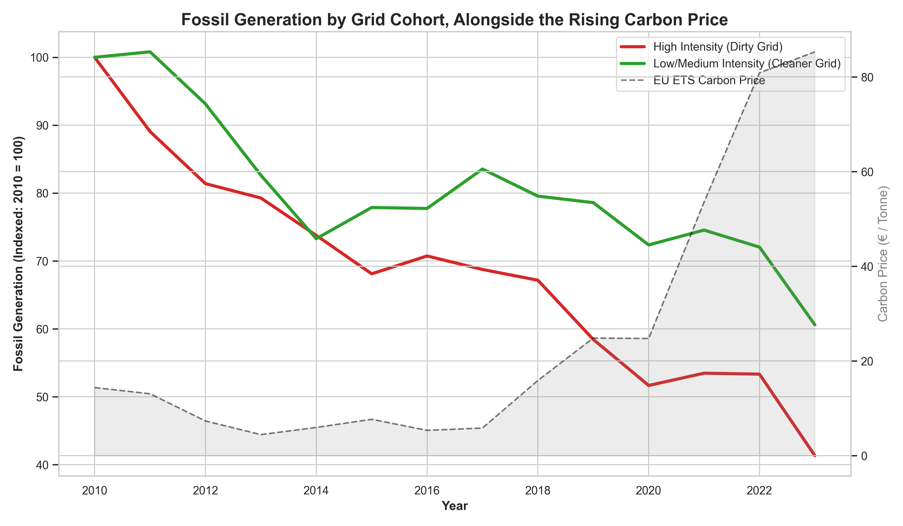

# 🌍 EU Green Transition & RED III Compliance Tracker

An end-to-end data engineering and econometric pipeline tracking European Union renewable energy deployment, evaluating progress against the RED III framework, and modelling the financial viability of zero-carbon infrastructure under carbon pricing.

## Table of Contents
- [🎯 The Central Question](#-the-central-question)
- [📊 Key Findings](#-key-findings)
- [🛠 Tech Stack & Pipeline Diagram](#-tech-stack--pipeline-diagram)
- [🔗 Data Sources](#-data-sources)
- [⚠️ Notes on Data & Methods](#️-notes-on-data--methods)
- [💻 How to Reproduce the Analysis](#-how-to-reproduce-the-analysis)
- [📂 Repository Structure](#-repository-structure)
- [📸 Dashboard Screenshots](#-dashboard-screenshots)

## 🎯 The Central Question
How does the rise in EU ETS carbon prices relate to the structural shift from fossil fuels to renewables, and what is the potential financial payoff of that transition under RED III targets?

*(Visualizing the macro transition)*


## 📊 Key Findings
* **Carbon prices and the generation shift (time-lagged & panel OLS):** A time-lagged OLS regression shows that a higher EU ETS carbon price in year *T* is associated with greater renewable generation in year *T+1*. A two-way fixed-effects (TWFE) panel model interacting carbon price with 2010 fossil-intensity further indicates that historically fossil-heavy grids reduced fossil generation faster as carbon prices rose. These are associational results on observational data, not proven causation.



* **Stranded-asset stress test (DCF/NPV):** A 20-year discounted-cash-flow model was built to stress-test asset values. Under the model's assumptions (8% WACC, a flat €80/tonne carbon price, 20-year horizon), a wind asset yields a positive NPV of roughly **+€1.9 billion** while an equivalent combined-cycle gas asset yields a negative NPV of about **−€0.16 billion** — illustrating relative fossil exposure risk. These figures are scenario outputs that depend on the chosen assumptions, not a market valuation.

* **RED III target tracking:** An interactive dashboard benchmarks EU member states against the **42.5%** EU-level renewable target for 2030. At current run-rates, several economies are off-pace, highlighting grid and deployment bottlenecks.

## 🛠 Tech Stack & Pipeline Diagram
A sequential pipeline bridging open-source scripting with business-intelligence reporting.

`[Python ETL] ➔ [SQL Aggregation] ➔ [Excel Financial Model] ➔ [Power BI Dashboard]`

* **Python (`pandas`, `statsmodels`, `linearmodels`):** data extraction (where an open API exists), cleaning, descriptive statistics, and OLS / panel fixed-effects regression modelling.
* **SQL:** relational queries for portfolio structuring and macro-level aggregation.
* **Excel:** scenario testing, sensitivity analysis, and NPV/DCF calculations.
* **Power BI:** interactive RED III compliance tracking and visualization with custom DAX measures.

## 🔗 Data Sources
* [Ember Electricity Data Explorer](https://ember-climate.org/data/data-explorer/) — historical generation mix.
* [Eurostat Energy Database](https://ec.europa.eu/eurostat/web/energy/database) — electricity prices and net imports. (Installed renewable capacity was incomplete; see Notes.)
* [Our World in Data](https://ourworldindata.org/co2-and-greenhouse-gas-emissions) — CO₂ emissions and GDP.
* EU ETS annual carbon prices — manually compiled from public records (see Notes).

## ⚠️ Notes on Data & Methods
A few honest caveats on scope and interpretation:
* **Carbon prices** are manually compiled annual EU ETS values, hardcoded in `01_fetch_data.py` rather than pulled from a live API.
* **Renewable "capacity"** is a **proxy**: Eurostat installed-capacity data was incomplete, so the analysis rescales renewable *generation* (TWh) to an MW-equivalent using a flat 25% capacity factor (`456.62 = 1,000,000 / (8,760 × 0.25)`). It is a linear transform of generation, so capacity-based results should be read as **renewable generation**, not measured installed capacity.
* **Identification:** the regressions are panel fixed-effects / OLS associations on observational data. They are consistent with carbon pricing driving the transition but do not, on their own, establish causation.
* **Financial model:** NPV/DCF results are scenario outputs that depend on the assumptions above; they illustrate relative risk, not a definitive valuation.

## 💻 How to Reproduce the Analysis
```bash
# 1. Clone the repository
git clone https://github.com/shashtg-git-some/green-transition-payoff.git
cd green-transition-payoff

# 2. Set up a virtual environment (Mac/Linux)
python3 -m venv venv
source venv/bin/activate

# 3. Install dependencies
pip install -r requirements.txt

# 4. Run the pipeline sequentially
python python/01_fetch_data.py
python python/02_clean_data.py
python python/03_exploratory_analysis.py
python python/04_visualize_data.py
python python/05_business_analytics.py
python python/06_panel_regression.py
python python/07_panel_visualizations.py
```

## 📂 Repository Structure
```text
green-transition-payoff/
├── data/                  # Raw CSVs (Ember/Eurostat/OWID) and processed outputs
├── excel/                 # green_transition_financial_model.xlsx (DCF valuation)
├── powerbi/               # red_iii_compliance_dashboard.pbix and static .pdf export
├── python/                # Core ETL and econometric codebase (01_fetch to 07_panel)
├── sql/                   # Queries for intermediate market aggregation
├── requirements.txt       # Python environment dependencies
└── README.md              # Project documentation
```

## 📸 Dashboard Screenshots


