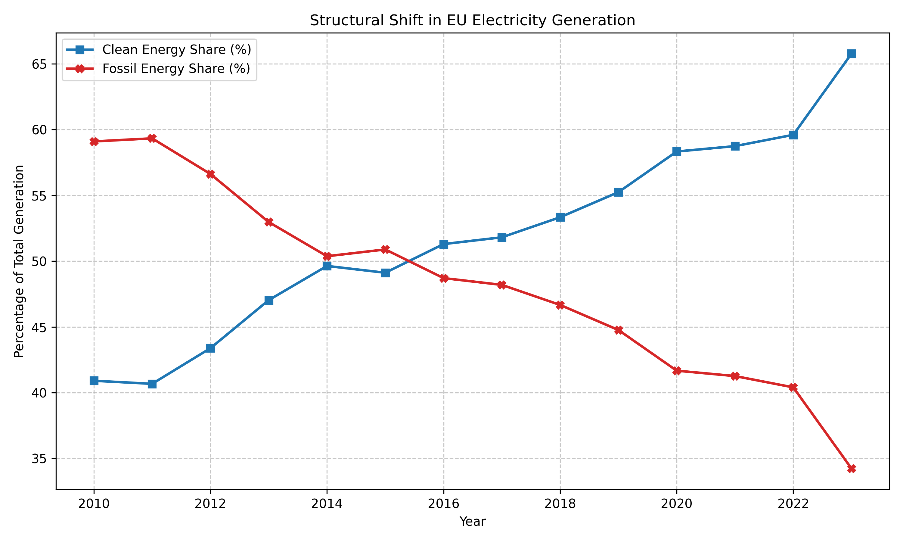
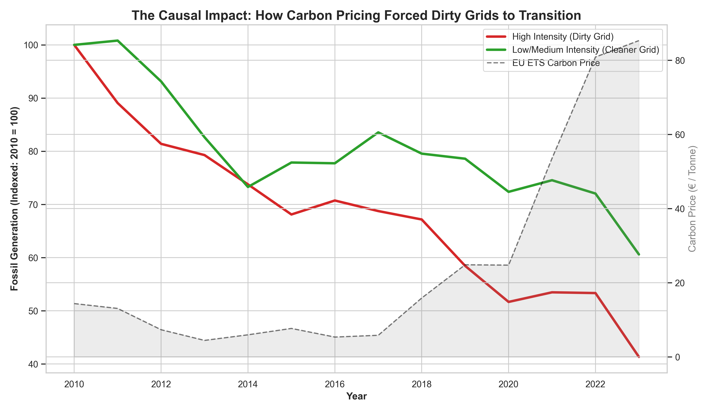
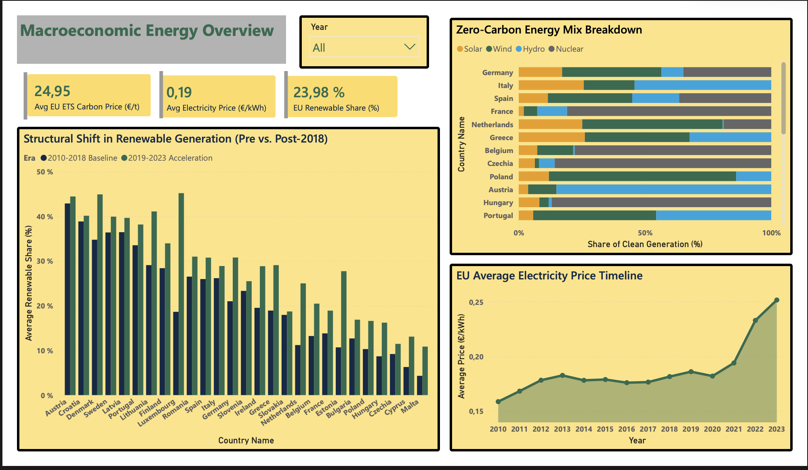
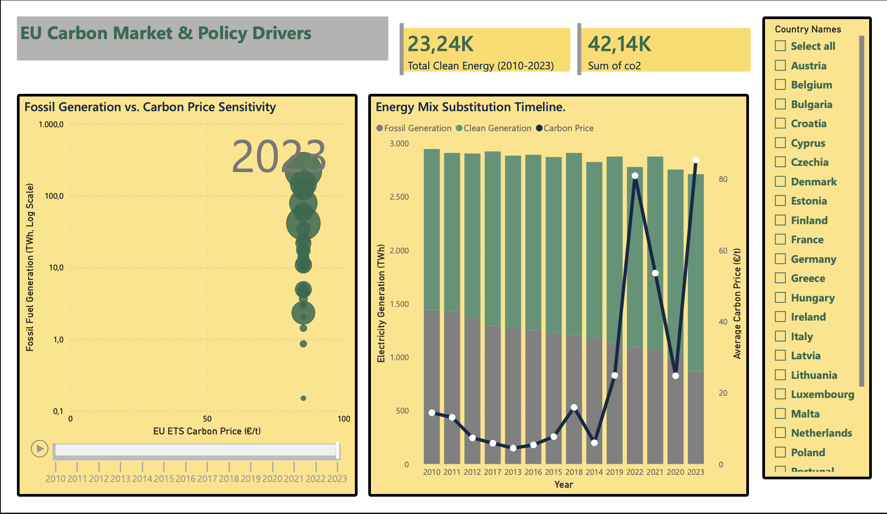
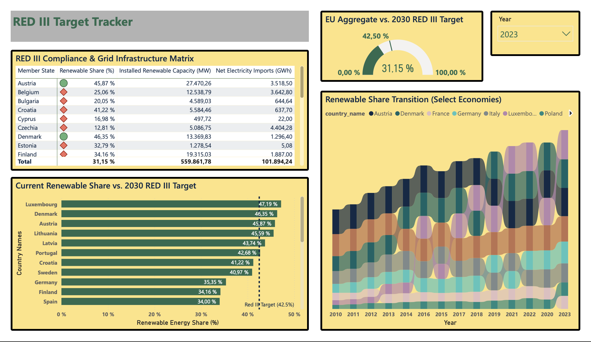

# 🌍 EU Green Transition & RED III Compliance Tracker

An end-to-end data engineering and econometric modeling pipeline tracking European Union renewable energy deployment, evaluating RED III policy compliance, and modeling the financial viability of zero-carbon infrastructure.

## Table of Contents
- [🎯 The Central Question](#-the-central-question)
- [📊 Key Findings](#-key-findings)
- [🛠 Tech Stack & Pipeline Diagram](#-tech-stack--pipeline-diagram)
- [🔗 Data Sources](#-data-sources)
- [💻 How to Reproduce the Analysis](#-how-to-reproduce-the-analysis)
- [📂 Repository Structure](#-repository-structure)
- [📸 Dashboard Screenshots](#-dashboard-screenshots)

## 🎯 The Central Question
How does the macroeconomic shock of rising EU ETS carbon prices accelerate the structural transition from fossil fuels to renewable energy, and what is the exact financial payoff of this transition under RED III targets?

*(Visualizing the Macro Transition)*


## 📊 Key Findings
* **The Policy Premium (Time-Lagged & Panel OLS):** Time-lagged OLS regression demonstrates a quantifiable relationship between carbon markets and physical infrastructure, where a €1 increase in the EU ETS carbon price in year $T$ is associated with a 0.090 GW increase in renewable capacity investment in year $T+1$. Additionally, a Hetero TWFE Panel OLS model utilizing high fossil intensity as a covariate confirms that historically dirty grids reduced fossil generation structurally faster under carbon price pressure.
  


* **Stranded Asset Risk (NPV Valuation):** A 20-year Discounted Cash Flow model (8% WACC) reveals a massive valuation gap under an €80/tonne carbon price: a standard Wind asset yields an NPV of **+€1.94 billion**, whereas an equivalent Combined-Cycle Gas asset yields **-€164 million**, quantifying severe long-term fossil exposure risk.
* **RED III Target Trajectories:** Despite aggressive transition timelines and capital reallocation, current tracking reveals localized grid infrastructure bottlenecks. At current run-rates, multiple key European economies are off-pace to clear the binding **42.5%** renewable generation threshold by 2030, highlighting the need for accelerated intervention.

## 🛠 Tech Stack & Pipeline Diagram
This project utilizes a sequential, automated data architecture bridging open-source scripting with enterprise business intelligence.

`[Python ETL] ➔ [SQL Aggregation] ➔ [Excel Financial Model] ➔ [Power BI Dashboard]`

* **Python (`pandas`, `statsmodels`):** Automated data extraction, cleaning, descriptive statistics, and causal OLS/Panel regression modeling.
* **SQL:** Relational database queries for portfolio structuring and macro-level market aggregation.
* **Excel:** Dynamic scenario testing, sensitivity analysis, and baseline NPV/DCF calculations.
* **Power BI:** Interactive, presentation-ready compliance tracking and data visualization utilizing custom DAX measures.

## 🔗 Data Sources
* [Ember Electricity Data Explorer](https://ember-climate.org/data/data-explorer/) (Historical Generation Mix)
* [Eurostat Energy Database](https://ec.europa.eu/eurostat/web/energy/database) (Electricity Prices & Renewable Capacity)
* [Our World in Data](https://ourworldindata.org/co2-and-greenhouse-gas-emissions) (CO2 Emissions & Carbon Pricing)

## 💻 How to Reproduce the Analysis
To clone this repository and run the Python pipeline locally, execute the following commands in your terminal:

```bash
# 1. Clone the repository
git clone [https://github.com/shashtg-git-some/green-transition-payoff.git](https://github.com/shashtg-git-some/green-transition-payoff.git)
cd green-transition-payoff

# 2. Set up a virtual environment (Mac/Linux)
python3 -m venv venv
source venv/bin/activate

# 3. Install required dependencies
pip install -r requirements.txt

# 4. Execute the pipeline sequentially
python python/01_fetch_data.py
python python/02_clean_data.py
python python/03_exploratory_analysis.py
python python/04_visualize_data.py
python python/05_business_analytics.py
python python/06_causal_inference.py
python python/07_causal_visualizations.py

## 📂 Repository Structure

green-transition-payoff/
├── data/                  # Raw CSVs (Ember/Eurostat) and processed outputs
├── excel/                 # green_transition_financial_model.xlsx (DCF Valuation)
├── powerbi/               # red_iii_compliance_dashboard.pbix and static .pdf export
├── python/                # Core ETL and econometric codebase (01_fetch to 07_causal)
├── sql/                   # Queries for intermediate market aggregation
├── requirements.txt       # Python environment dependencies
└── README.md              # Project documentation

## 📸 Dashboard Screenshots




